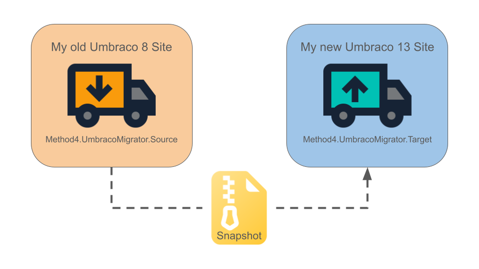

# Method4.UmbracoMigrator.Source
[](https://opensource.org/licenses/MPL-2) 
[](https://www.nuget.org/packages/Method4.UmbracoMigrator.Source) 
[](https://www.nuget.org/packages/Method4.UmbracoMigrator.Source)
[](https://marketplace.umbraco.com/package/method4.umbracomigrator.source)

## What is the Method4.UmbracoMigrator?
The Method4 Umbraco Migrator allows migrating content and media from an Umbraco v7/v8 site to an Umbraco v10+ site.

This tool was originally created as an internal tool for us at Method4, to make migrating our client's Umbraco sites easy, and we've decided to make it available as an open-source package; as we believe other devs in the Umbraco community may find it useful too.

Read our blog post about this tool here: [TODO Insert Link]

The migrator tool consists of 2 packages, _Method4.UmbracoMigrator.Source_ and _Method4.UmbracoMigrator.Target_.

### 📤 [Method4.UmbracoMigrator.Source](https://github.com/Method4Ltd/Method4.UmbracoMigrator.Source)
Generates the Migration Snapshot (.zip) files that will be imported into your new Umbraco v10+ site using the Target package.

### 📤 [Method4.UmbracoMigrator.Target](https://github.com/Method4Ltd/Method4.UmbracoMigrator.Target)
Imports the migration snapshots and runs mappers to transform the data.

Please view the Method4.UmbracoMigrator.Target repo to find out about all of the available features, which include:
- Repeatable imports
    - Subsequent migration imports will simply update the previously migrated nodes, rather than creating new nodes, when imported.
- Custom Mappings
    - Define custom mapping logic by implementing our `IDocTypeMapping`/`IMediaTypeMapping` interfaces.
- Default Mappings
    - The package ships with built-in default mappers that perform "lazy" mappings, e.g. if an old Node's DocType matches one of our new DocTypes it will attempt to map it, and if any of its properties have identical aliases, then their raw values be copied across.
- Automatically convert Media Picker formats
    - MediaPicker (legacy) can be converted to the new MediPicker 3's format automatically

## 🛠️Features


### ⚙️ Configurable snapshot exports
You can select which root nodes to include in your migration snapshot, include only published nodes, and whether or not to include the physical media files.

### 🖼️ Supports Azure Blob Storage
Physical media files will be downloaded from Azure Blob storage if it is being used.

## 🚀 Installation & Umbraco Version Support
> The Package's major versions will match the minimum compatible Umbraco version.<br>
> Whilst this does go against semantic versioning, it should make it easier to figure out which version will work for you.<br>
> We'll try to keep breaking changes out of minor versions, but they may happen if we need them.

<table>
  <tr>
    <th><strong>Umbraco Version</strong></th>
    <th><string>Package Version</strong></th>
  </tr>
  <tr>
    <td>v7</td>
    <td>v7.x</td>
  </tr>
  <tr>
    <td>v8</td>
    <td>v8.x</td>
  </tr>
</table>

### NuGet package repository

To [install from NuGet](https://www.nuget.org/packages/Method4.UmbracoMigrator.Source), you can run the following command from the `dotnet` CLI:

```
dotnet add package Method4.UmbracoMigrator.Source
```

## 📄 [Documentation](./docs/README.md)
Documentation can be found in the `/docs` folder.

### How do I import a migration snapshot?
You will need to install the [Method4.UmbracoMigrator.Target](https://github.com/Method4Ltd/Method4.UmbracoMigrator.Target) package onto your target website, to import the snapshots.



## ❤️ Support
This package was originally created as an internal tool for us at Method4, to make migrating our client's Umbraco sites easy, and we've decided to make it available as an open-source package; as we believe other devs in the Umbraco community may find it useful too.

The package will be updated as and when we need it, feel free to report any bugs/issues you find, contribute by opening a pull request, and we will take a look when we have capacity. Please read the [Contributing Guide](./docs/CONTRIBUTING.md) for information on how to set up the project locally.

## 🛣️ Roadmap
Please see the [roadmap](./docs/ROADMAP.md) for a list of outstanding features and TODOs.

## 📝 License
Copyright &copy; [Method4](https://www.method4.co.uk/).

All source code is licensed under the [Mozilla Public License](./LICENSE).

## 🤝 Acknowledgements
### Developers

- [Owain Jones](https://owainjones.dev) - ([GitHub](https://github.com/OwainJ), [Mastodon](https://umbracocommunity.social/@ojodev), [Twitter](https://twitter.com/The_DarkGhost))

### Logo
The package logo uses the [Local Shipping](https://fonts.google.com/icons?selected=Material%20Symbols%20Outlined%3Alocal_shipping%3AFILL%400%3Bwght%40400%3BGRAD%400%3Bopsz%4024) icon from [Google Fonts](https://fonts.google.com/icons), licensed under [SIL Open Font License](https://openfontlicense.org/).

## 🙌 Alternatives
If this package doesn't fit your needs, then check out these other awesome community packages:
- [uSyncMigrations](https://github.com/Jumoo/uSyncMigrations)
