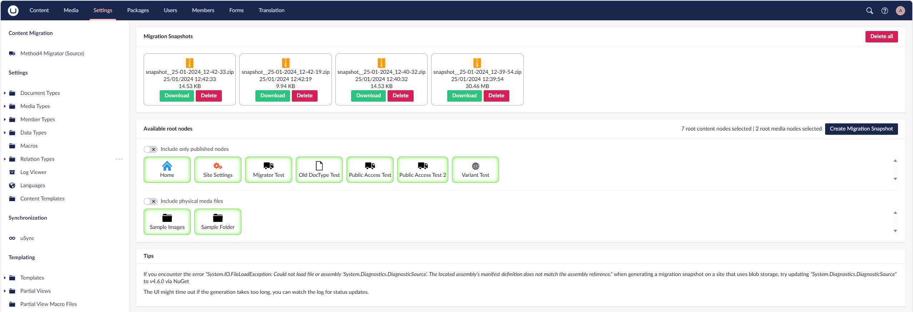

# Method4.UmbracoMigrator.Source - Documentation

Please see the [roadmap](./ROADMAP.md) for a list of outstanding features and TODOs.

# The Backoffice Dashboard
The dashboard can be found on the tree in the `Settings` section.


Here you can select which root nodes are included in your migration snapshot.
Generated snapshots can be downloaded and deleted, they are stored on the server at `App_Data\TEMP\M4Migrator\snapshots\`

# Migration Snapshots
These .zip files contain a representation of your site's content nodes, media nodes, and a copy of all media files.
Media is retrieved either from the default disk "/media" folder or from Azure Blob storage.

## Migration Snapshot .zip structure
```
.zip
├─ Content.xml
├─ Media.xml
├─ Media/
│  ├─ cpth2fx5/
│  │  ├─ image.png
│  ├─ ....
```
- Content.xml
     - XML representation of your content nodes
- Media.xml
     - XML representation of your media nodes
- Media (folder)
     - A copy of your uploaded media folder

# Tips
If you encounter the error `System.IO.FileLoadException: Could not load file or assembly 'System.Diagnostics.DiagnosticSource'. The located assembly's manifest definition does not match the assembly reference.` when generating a migration snapshot on a site that uses blob storage, try updating `System.Diagnostics.DiagnosticSource` to _v4.6.0_ via NuGet.